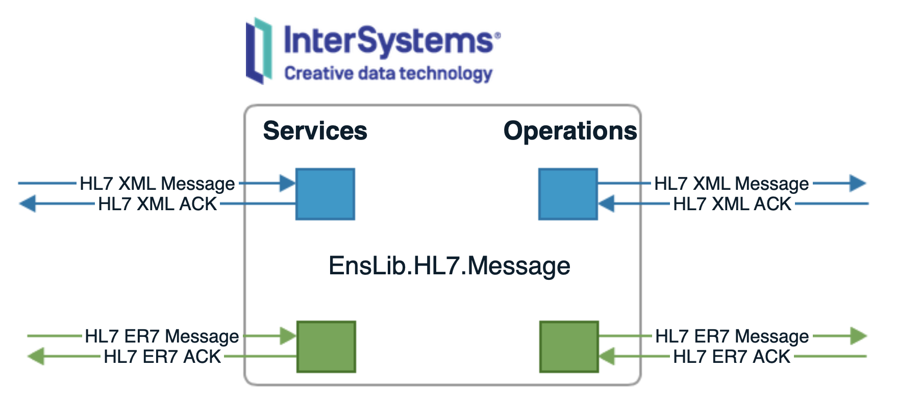

*Healthcare HL7 XML* (also known as *ITB* or *Ensemble HL7 XML*) is an application you can install in [InterSystems Healthcare products](https://www.intersystems.com) to handle HL7 v.2.x messages in XML format.

# What is included?
*Healthcare HL7 XML* includes *Business Services* and *Operations* you can use in your productions to handle *ER7* and *XML HL7 messages* in the same way.

# Documentation
See the [Wiki](https://github.com/intersystems-ib/healthcare-hl7-xml/wiki) for documentation and installation guide.
